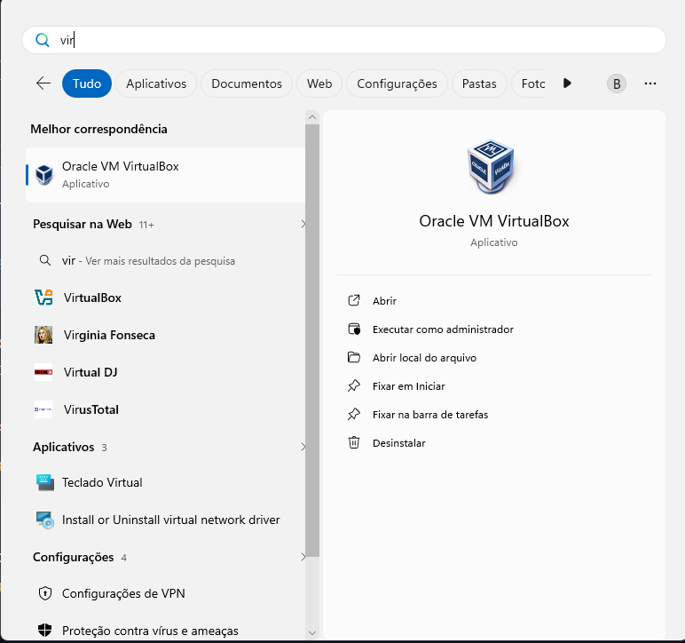
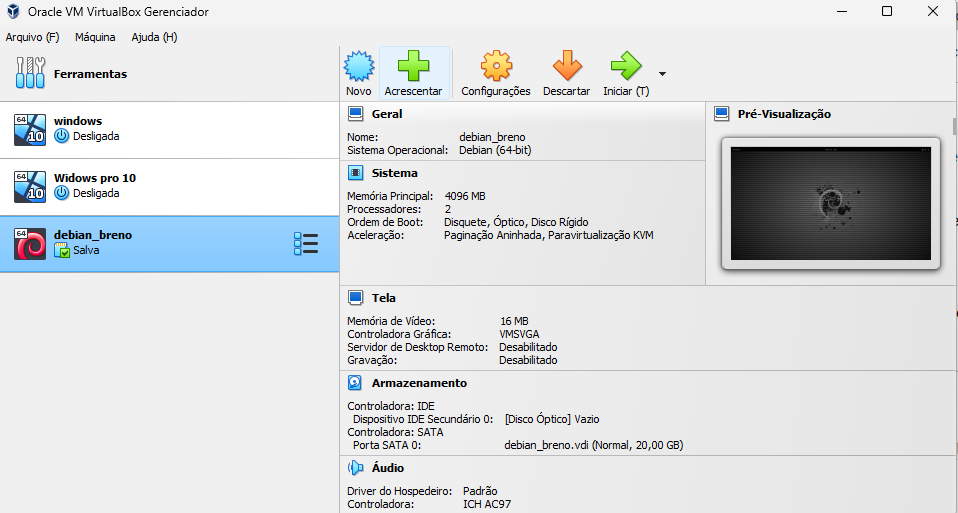
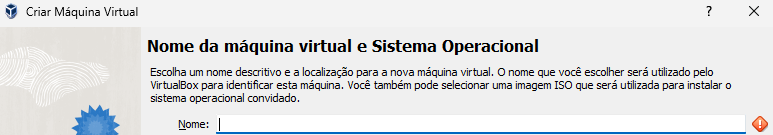

# Manual de Instalacao Linux

***PRIMEIRO PASSO***

---

#### 1- "Abra o VirtualBox para iniciar o processo de instalação do Linux."

***SEGUNDO PASSO***

#### 2- Clique em "Novo"

***TERCEIRO PASSO***

#### 3- Escolha o nome da sua maquina usando debian Ex: debian_Seu Nome

